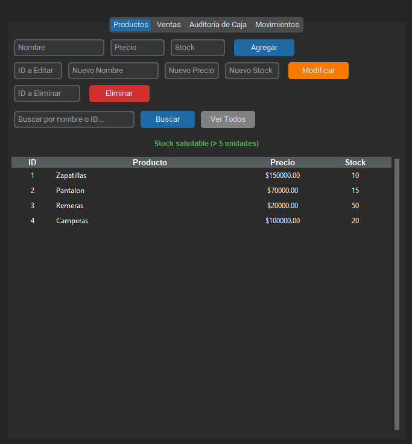
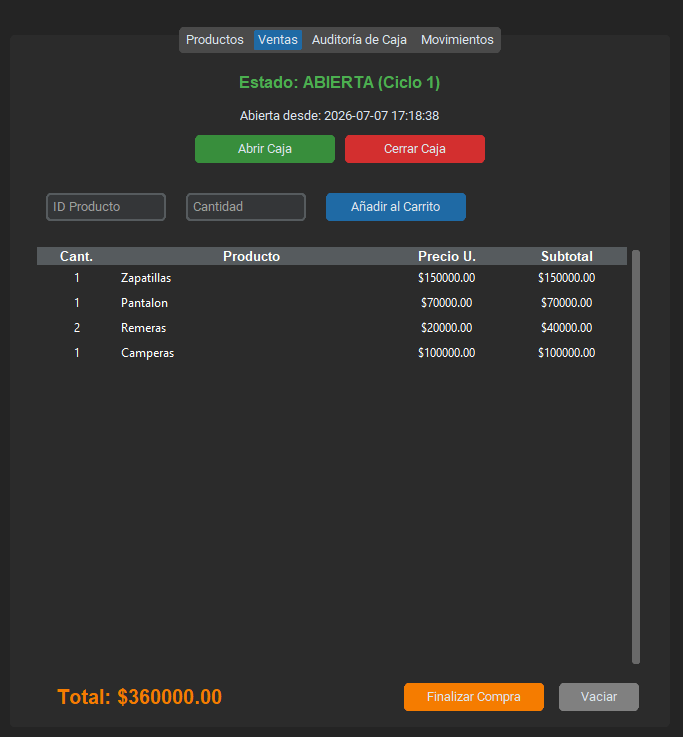
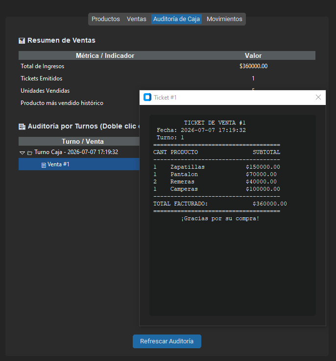

# Sistema de Gestión Comercial

Este es mi proyecto final de programación para la carrera de Ciencia de Datos e Inteligencia Artificial en ISTEA. El objetivo fue armar un sistema de escritorio para gestionar un negocio, manejando el stock, las ventas y la auditoría de la caja.

## Vistas del Programa

### Gestión de Productos


---

### Punto de Venta


---

### Auditoría de Caja


---

## ¿Qué hace el programa?
* **Productos:** Tiene un CRUD completo. Podés agregar, buscar, modificar y borrar productos. Además, le agregué una alerta que te avisa automáticamente si algún producto tiene menos de 5 unidades en stock.
* **Ventas:** Es la caja del negocio. Podés abrir turno, ir cargando cosas al carrito y te calcula los subtotales y el total. Si intentás vender más de lo que hay en stock, el sistema te frena.
* **Auditoría de Caja:** Acá quedan registrados todos los turnos. Podés ver cuánto se vendió y si le hacés doble clic a una venta, podés ver el detalle exacto del ticket.
* **Movimientos:** Un historial que va guardando cada acción importante que pasa en el programa para tener un registro de todo.

## ¿Cómo probarlo para la evaluación?
Decidí entregar el programa con la base de datos totalmente limpia. Creo que no teniendo ningún producto precargado se pueden probar al 100% las funcionalidades del programa desde cero.

**Pasos para correrlo:**

1. Crear un entorno virtual dentro de la carpeta del proyecto:

   ```bash
   python -m venv .venv
   ```

2. Activar el entorno virtual:

   ```powershell
   .venv\Scripts\activate
   ```

3. Instalar las librerías necesarias ejecutando en la consola:

   ```bash
   pip install -r requirements.txt
   ```

4. Ejecutar el archivo `main.py`.

5. Ir a la pestaña **Productos** y crear un par de artículos.

6. Ir a **Ventas**, abrir la caja y probar agregar los productos al carrito para finalizar la compra.

7. Revisar la pestaña **Auditoría** para ver cómo se registró el turno.

## Tecnologías y Librerías que usé
Para este proyecto dividí el uso de herramientas entre las nativas de Python y un par de externas para mejorar la interfaz y el manejo de datos:

**Librerías Externas (requieren instalación):**
* `customtkinter`: Para diseñar una interfaz gráfica moderna, modular y en modo oscuro.
* `pandas`: Para procesar el historial de ventas y calcular las estadísticas globales en la auditoría.

**Librerías Nativas (Standard Library):**
* `tkinter`: Específicamente los módulos `ttk` (para las tablas Treeview) y `messagebox` (para las alertas emergentes).
* `json`: Para el motor de persistencia de datos y el CRUD.
* `datetime`: Para el sellado de tiempo en los turnos de caja, tickets y el logger.
* `os`: Para la validación de rutas y creación segura de archivos.

---
*Desarrollado por Agustín Alberto Martin.*
